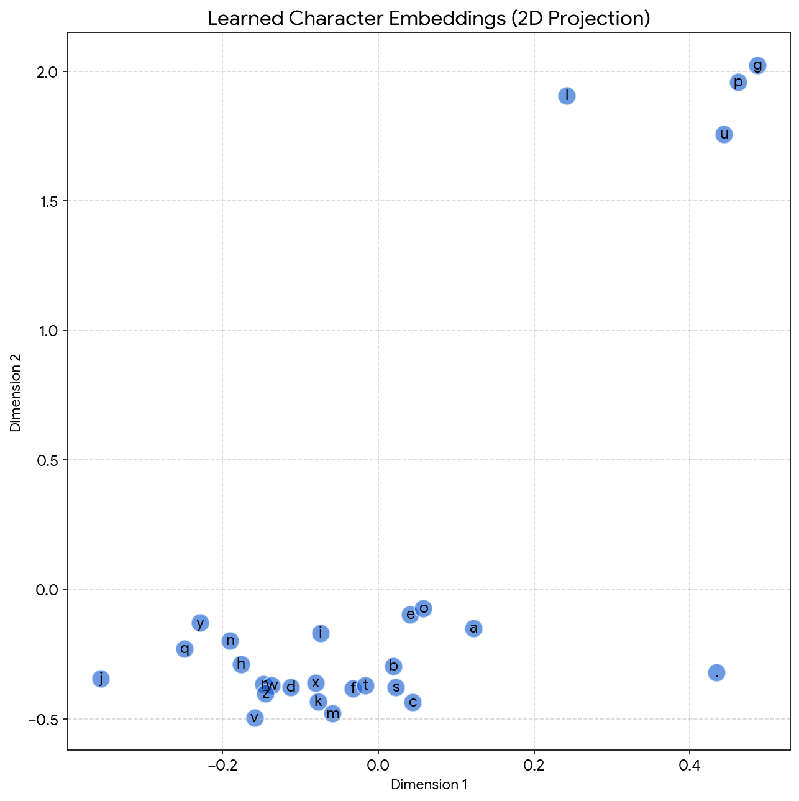

# Character-Level Language Model (MLP)

This project implements a character-level language model based on the architecture proposed by **Bengio et al. (2003)**. 

Unlike simple bigram models that only look at one previous character, this model uses a **Multi-Layer Perceptron (MLP)** with a context window to predict the next character in a sequence.

## 🧠 Key Concepts

### 1. Context Window
The model looks at a fixed number of previous characters (e.g., 3) to make its prediction. This allows it to understand patterns like "qu" (where 'u' usually follows 'q') or common name endings.

### 2. Learned Embeddings
Each character is mapped to a vector in a continuous space. During training, the model learns to group similar characters together automatically.

## 📊 Visualization: Character Embeddings

One of the most powerful features of this model is its ability to learn relationships between characters. 

The plot below shows the learned 2D embeddings of the characters. Notice how **vowels** (a, e, i, o, u) and other similar characters naturally cluster together, while special characters like the start/end token (.) behave differently.

*(Generated using a specialized 2D embedding model for visualization purposes)*

## 📉 Performance

| Model | Validation Loss | Notes |
|-------|-----------------|-------|
| Bigram (Statistical) | ~2.48 | Random outputs, no context. |
| **MLP (This Model)** | **~2.20** | **Significant improvement.** Names are more coherent. |

## 🛠️ Tech Stack
* **Python**
* **PyTorch** (for building the neural network)
* **Matplotlib** (for visualizing the embeddings)

## 🚀 How to Run
1. Ensure you have `torch` and `matplotlib` installed.
2. Run the `MoreMakeMore.ipynb` notebook to train the full model.
3. The model trains on `names.txt` (a dataset of 32k names).
